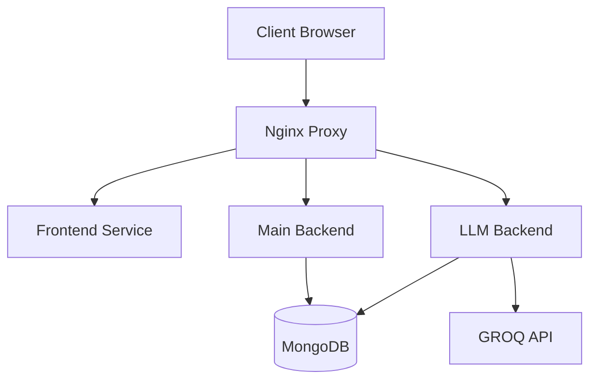

# System Architecture Documentation

## Overview

The system is built as a modern, containerized microservices architecture that combines a Next.js frontend, dual Python backends (main API and LLM service), MongoDB database, and Nginx reverse proxy. The entire application is containerized using Docker and orchestrated with Docker Compose, making it highly portable and scalable.

## System Components

### 1. Frontend Service (Next.js)

- **Technology Stack:**
  - Next.js framework
  - React for UI components
  - TypeScript for type safety
  - TailwindCSS for styling
- **Key Features:**
  - Server-side rendering (SSR)
  - Client-side routing
  - API integration with both backend services
  - Responsive design
- **Configuration:**
  - Exposed on port 3000 internally
  - Environment variables for API endpoints
  - Hot-reloading enabled for development
  - Volume mounts for code changes

### 2. Main Backend Service (Python)

- **Technology Stack:**
  - Python
  - Flask framework
  - MongoDB for data persistence
- **Responsibilities:**
  - User authentication and authorization
  - CRUD operations for application data
  - Business logic implementation
  - Session management
- **Configuration:**
  - Runs on port 5000
  - Direct MongoDB connection
  - RESTful API endpoints

### 3. LLM Backend Service (Python)

- **Technology Stack:**
  - Python
  - Flask framework
  - GROQ API integration
  - MongoDB for data persistence
- **Responsibilities:**
  - Language model integration
  - Natural language processing
  - AI-powered features
  - Response generation
- **Configuration:**
  - Runs on port 5000
  - GROQ API key integration
  - Specialized endpoints for LLM operations
  - Asynchronous processing capabilities

### 4. Database Layer (MongoDB)

- **Technology Stack:**
  - MongoDB latest version
  - Persistent volume storage
- **Configuration:**
  - Exposed on port 27017
  - Root authentication enabled
  - Initialization scripts support
  - Persistent data storage
- **Features:**
  - Document-based storage
  - High performance
  - Scalability
  - Data persistence across restarts

### 5. Reverse Proxy (Nginx)

- **Technology Stack:**
  - Nginx latest version
  - Custom configuration
- **Responsibilities:**
  - Request routing
  - Load balancing
  - SSL termination (in production)
  - Static file serving
- **Configuration:**
  - Listens on port 80
  - Routes traffic to appropriate services
  - Handles WebSocket connections
  - Implements compression
  - Manages request size limits

## Service Interactions

### Request Flow

1. **Client Request:**

   - All requests go through Nginx (port 80)
   - Nginx routes based on URL patterns:
     - `/` → Frontend service
     - `/api/` → Main backend
     - `/llm-api/` → LLM backend

2. **Service Communication:**
   - Frontend → Backend: REST API calls
   - Frontend → LLM Backend: REST API calls
   - Backend → MongoDB: Direct connection
   - LLM Backend → MongoDB: Direct connection
   - LLM Backend → GROQ API: External API calls

### Dependencies

## Security Architecture

The security architecture of this system is documented in detail in [security-architecture.md](./security-architecture.md). This dedicated security documentation covers:

- Authentication and Authorization Flows
- Security Measures and Controls
- Best Practices
- Incident Response Procedures
- Compliance and Regulations
- Security Maintenance

For all security-related information, please refer to the security architecture documentation.

## Scalability and Performance

### Performance Optimizations

1. **Nginx Layer:**

   - Gzip compression
   - Cache control
   - WebSocket support
   - Keep-alive connections

2. **Application Layer:**
   - Server-side rendering
   - Code splitting
   - Caching strategies
   - Optimized database queries

### Scalability Features

- Containerized architecture
- Stateless services
- Independent scaling
- Load balancing ready
- Database replication support

## Monitoring and Logging

### Logging

- Nginx access and error logs
- Application-level logging
- Database logging
- Container logs
- API request/response logging

### Monitoring Points

- Service health
- System resources
- API endpoints
- Database performance
- Error rates
- Response times

## Development and Deployment

### Development Environment

- Hot-reloading enabled
- Volume mounts for live changes
- Development-specific configurations
- Local environment variables

### Deployment Configuration

- Production-ready Docker images
- Environment-specific settings
- Automated container orchestration
- Health checks
- Restart policies

## Future Considerations

### Potential Enhancements

1. **Scalability:**

   - Container orchestration (Kubernetes)
   - Database clustering
   - Caching layer (Redis)

2. **Monitoring:**

   - APM integration
   - Metrics collection
   - Centralized logging

3. **Security:**
   - SSL/TLS implementation
   - Advanced authentication
   - Security scanning
