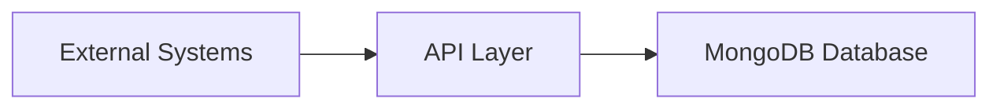
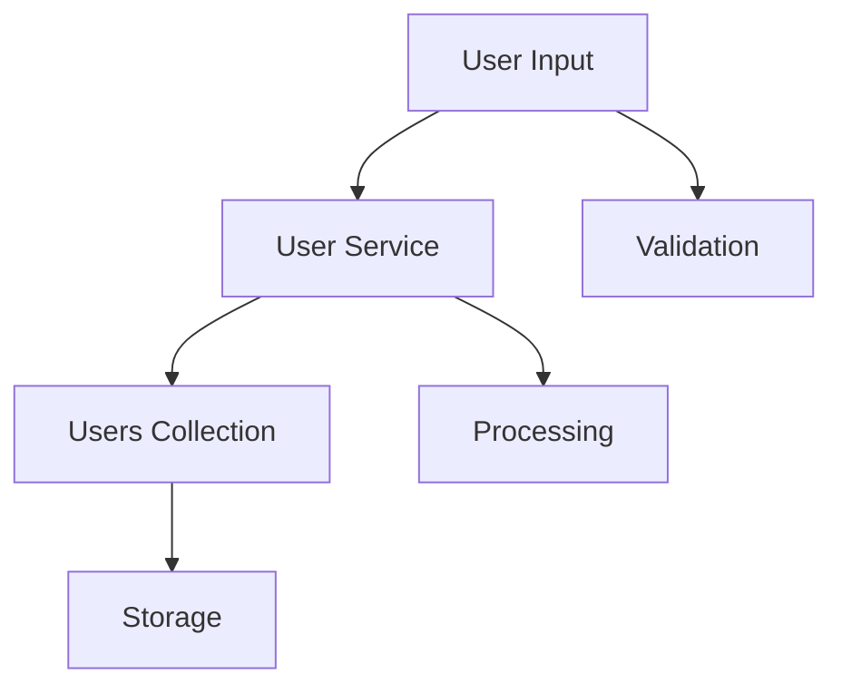
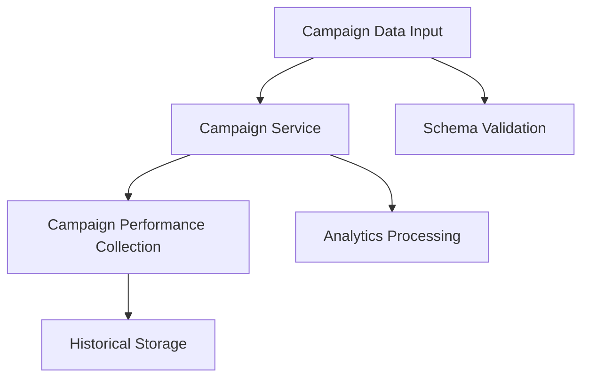
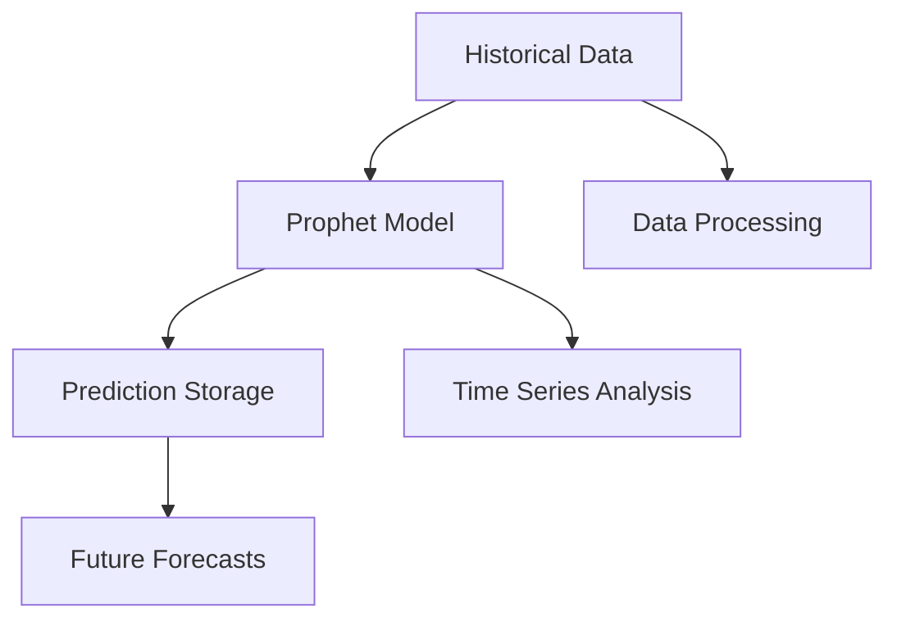

# Data Flow Documentation

## 1. System Overview
The system implements a MongoDB-based data architecture with three main data domains:
- User Management
- Campaign Performance Analytics
- Prophet Predictions

## 2. Data Flow Diagrams

### 2.1 High-Level Data Flow

### 2.2 Detailed Data Flows

#### 2.2.1 User Data Flow

Data Fields:
- username
- email
- role
- company
- password
- chart_access
- report_generation_access
- user_management_access

#### 2.2.2 Campaign Performance Data Flow

Data Fields:
- date
- campaign_id
- channel
- age_group
- ad_spend
- views
- leads
- new_accounts
- country
- revenue

#### 2.2.3 Prophet Prediction Data Flow

Data Fields:
- date
- revenue
- ad_spend
- new_accounts

## 3. Data Transformation Points

### 3.1 Input Transformations
1. **User Data**:
   - Password hashing
   - Role validation
   - Access rights assignment

2. **Campaign Data**:
   - Date normalization
   - Currency conversion
   - Metric calculations

3. **Prediction Data**:
   - Time series formatting
   - Feature engineering
   - Data normalization

### 3.2 Storage Transformations
1. **MongoDB Document Structure**:
   - Schema validation
   - Index creation
   - Data type conversion

2. **Collection Management**:
   - Automatic collection creation
   - Document versioning
   - Data archival

## 4. Data Access Patterns

### 4.1 Read Operations
- Direct collection access through `get_collection()`
- Schema validation before processing
- Indexed queries for performance

### 4.2 Write Operations
- Batch inserts for campaign data
- Atomic updates for user data
- Time-series data appends for predictions

### 4.3 Delete Operations
- Protected user collection (no deletion allowed)
- Campaign data clearing (preserves structure)
- Prediction data archival

## 5. Data Validation Points

### 5.1 Schema Validation
- User schema validation
- Campaign performance schema validation
- Prophet prediction schema validation

### 5.2 Business Logic Validation
- Access control validation
- Data integrity checks
- Temporal consistency validation

## 6. Data Security Measures

### 6.1 Access Control
- Role-based access control
- Collection-level permissions
- Operation-level restrictions

### 6.2 Data Protection
- Password hashing
- Sensitive data encryption
- Audit logging
