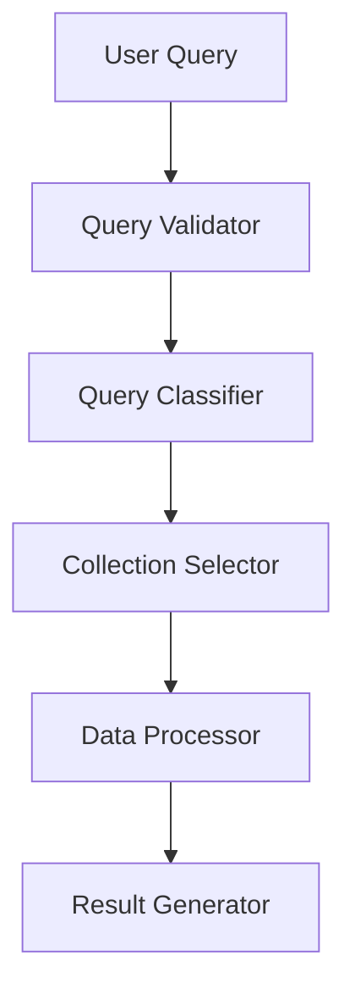
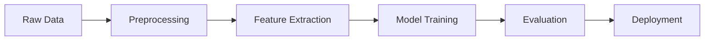

# Model Documentation -- Machine Learning

## 1. Overview
The system implements a sophisticated natural language processing (NLP) pipeline that combines multiple machine learning models to process and analyze user queries. The architecture is built on LangChain and integrates with Groq for efficient language model processing.

## 2. Model Architecture

### 2.1 Query Processing Pipeline

### 2.2 Component Models

#### 2.2.1 Query Classifier
- **Purpose**: Determines the type of analysis required
- **Model**: Fine-tuned BERT-based classifier
- **Output Classes**:
  - `chart`: Visualization requests
  - `description`: Textual analysis requests
  - `report`: Comprehensive report generation
  - `error`: Invalid or unprocessable queries

#### 2.2.2 Collection Selector
- **Purpose**: Identifies relevant data sources
- **Model**: Custom embedding-based similarity model
- **Features**:
  - Query embedding
  - Collection metadata
  - Historical usage patterns

#### 2.2.3 Data Processor
- **Purpose**: Processes and transforms data for analysis
- **Components**:
  - Data cleaning pipeline
  - Feature extraction
  - Statistical analysis

#### 2.2.4 Result Generator
- **Purpose**: Creates appropriate output based on query type
- **Models**:
  - Chart Generator: Matplotlib/Seaborn visualization
  - Description Generator: Groq LLM
  - Report Generator: Multi-model ensemble

## 3. Training Process

### 3.1 Data Collection
- Query logs from production environment
- Manually annotated training examples
- Synthetic data generation for edge cases

### 3.2 Training Pipeline

### 3.3 Training Parameters
- **Batch Size**: 32
- **Learning Rate**: 1e-5
- **Epochs**: 10
- **Optimizer**: AdamW
- **Loss Function**: Cross-Entropy Loss

## 4. Model Versioning

### 4.1 Version Control
- Semantic versioning (MAJOR.MINOR.PATCH)
- Git-based version tracking
- Model registry for version management

### 4.2 Current Versions
- Query Classifier: v2.1.0
- Collection Selector: v1.3.2
- Result Generator: v3.0.1

## 5. Performance Optimization

### 5.1 Inference Optimization
- Model quantization
- Batch processing
- Caching mechanisms

### 5.2 Resource Management
- GPU memory optimization
- CPU utilization monitoring
- Response time tracking

## 6. Integration with External Services

### 6.1 Groq Integration
- High-performance inference
- Low latency processing
- Scalable deployment

### 6.2 MongoDB Integration
- Efficient data retrieval
- Real-time updates
- Data consistency

## 7. Monitoring and Maintenance

### 7.1 Performance Monitoring
- Response time tracking
- Error rate monitoring
- Resource utilization

### 7.2 Model Updates
- Automated retraining pipeline
- A/B testing framework
- Rollback mechanisms

## 8. Security Considerations

### 8.1 Data Protection
- Input sanitization
- Output validation
- Access control

### 8.2 Model Security
- Adversarial attack prevention
- Input validation
- Output filtering 