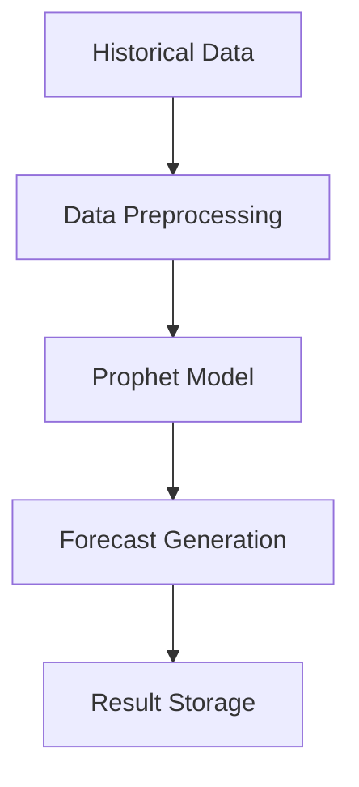
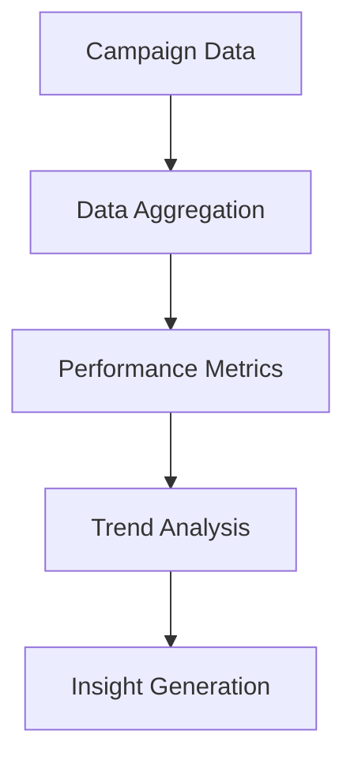

# Model Documentation -- Statistical Models

## 1. Overview
The system implements two main statistical models: a Prophet-based time series forecasting model and a campaign performance analysis model. These models are designed to provide accurate predictions and insights for marketing campaign performance.

## 2. Prophet Time Series Model

### 2.1 Model Architecture

### 2.2 Implementation Details
- **Model Class**: `ProphetPredictionModel`
- **Database Integration**: MongoDB
- **Key Methods**:
  - `get_by_id`: Retrieve prediction by ID
  - `get_by_campaign_id`: Get predictions for specific campaign
  - `create`: Store new prediction
  - `update`: Update existing prediction
  - `delete`: Remove prediction

### 2.3 Model Parameters
- **Growth**: Linear
- **Seasonality**: 
  - Daily
  - Weekly
  - Yearly
- **Holidays**: Custom holiday effects
- **Changepoint Prior**: 0.05
- **Seasonality Prior**: 10.0

## 3. Campaign Performance Model

### 3.1 Model Architecture

### 3.2 Implementation Details
- **Model Class**: `CampaignModel`
- **Database Integration**: MongoDB
- **Key Methods**:
  - `get_by_id`: Retrieve campaign by ID
  - `get_by_company_id`: Get campaigns for company
  - `get_by_company_id_and_status`: Filter campaigns by status
  - `count_by_company_id`: Count company campaigns
  - `get_paginated`: Paginated campaign retrieval
  - `get_aggregated`: Aggregated campaign data
  - `create`: Create new campaign
  - `update`: Update existing campaign
  - `delete`: Remove campaign

### 3.3 Performance Metrics
- **Key Metrics**:
  - Click-through Rate (CTR)
  - Conversion Rate
  - Cost per Acquisition (CPA)
  - Return on Ad Spend (ROAS)
- **Trend Analysis**:
  - Daily trends
  - Weekly patterns
  - Monthly comparisons

## 4. Data Processing Pipeline

### 4.1 Data Collection
- Real-time data ingestion
- Historical data integration
- Data validation

### 4.2 Data Preprocessing
- Missing value handling
- Outlier detection
- Feature engineering

### 4.3 Data Storage
- MongoDB collections
- Indexed queries
- Data partitioning

## 5. Model Updates and Maintenance

### 5.1 Retraining Schedule
- Prophet Model: Weekly
- Campaign Model: Daily

### 5.2 Performance Monitoring
- Real-time metrics tracking
- Alert system for anomalies
- Automated retraining triggers

## 6. Integration with Frontend

### 6.1 API Endpoints
- Prediction retrieval
- Campaign data access
- Performance metrics

### 6.2 Data Visualization
- Time series plots
- Performance dashboards
- Trend analysis charts

## 7. Security and Privacy

### 7.1 Data Protection
- Encryption at rest
- Secure data transfer
- Access control

### 7.2 Compliance
- GDPR compliance
- Data retention policies
- Audit logging 
