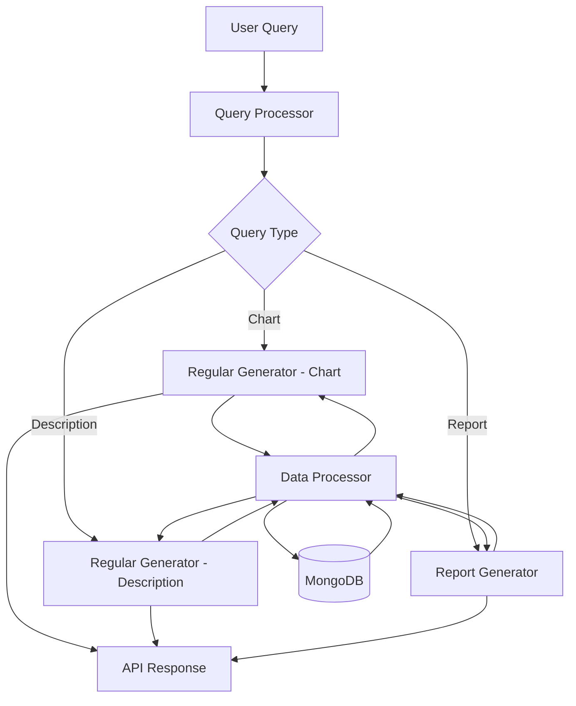
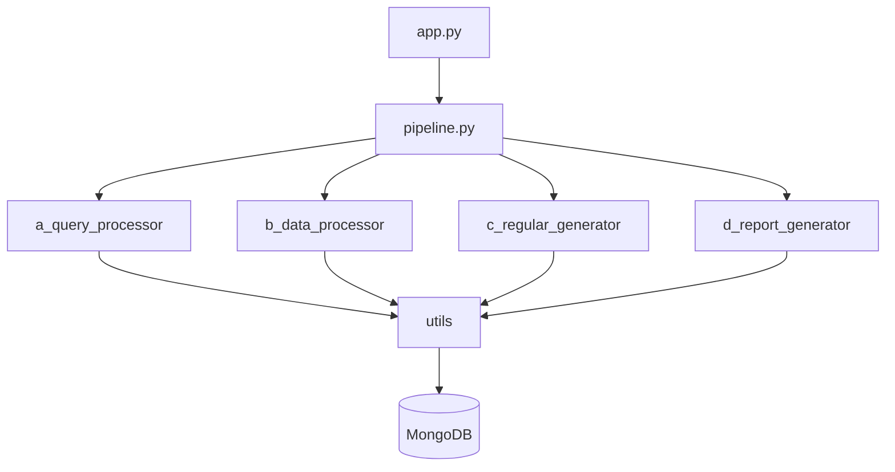

# LLM-Powered Analytics Backend Documentation

This directory contains comprehensive documentation for the LLM-Powered Analytics Backend system.

## Documentation Structure

### Core Documentation

- [Architecture Overview](/6b-llm-architecture) - System architecture, data flow, and component relationships
- [API Reference](/6c-llm-api) - REST API endpoints, request/response formats, and examples

### Component Documentation

- [Query Processor](/6e-1-llm-query-processor) - Documentation for the query validation and classification module
- [Data Processor](/6e-2-data-processor) - Documentation for data collection selection and processing
- [Regular Generator](/6e-3-regular-generator) - Documentation for chart and description generators
- [Report Generator](/6e-4-report-generator) - Documentation for complex report generation
- [Utilities](/6d-llm-utils) - Documentation for database, logging, and LLM configuration utilities

## Quick Reference

### System Flowchart

### Component Relationships

## Getting Started

For a new developer, we recommend reviewing the documentation in the following order:

1. [Architecture Overview](/6b-llm-architecture) to understand the system design
2. Component-specific documentation based on your area of interest
3. [API Reference](/6c-llm-api) to understand how to interact with the system
