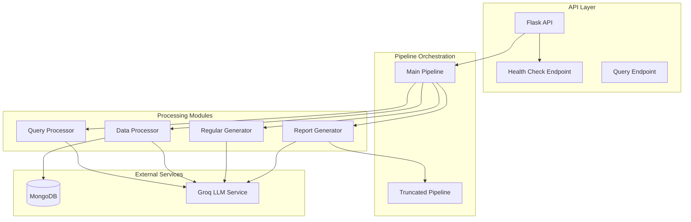
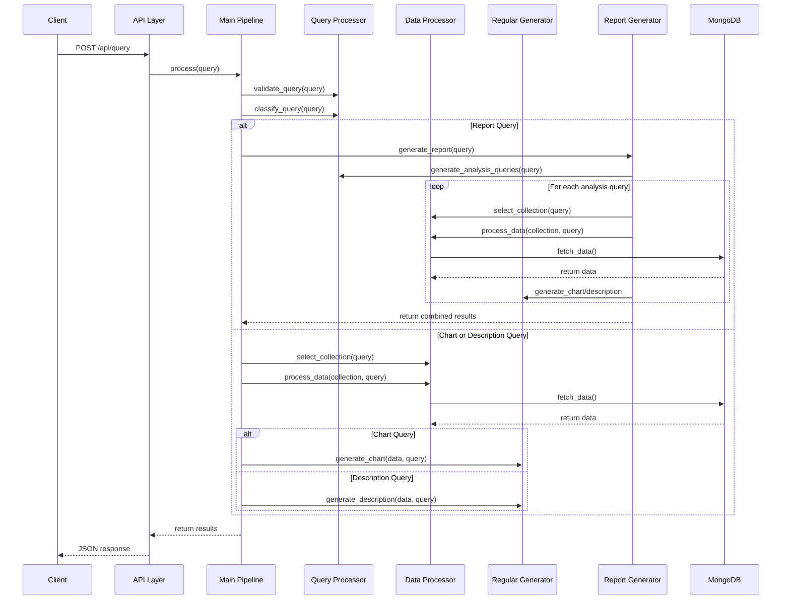
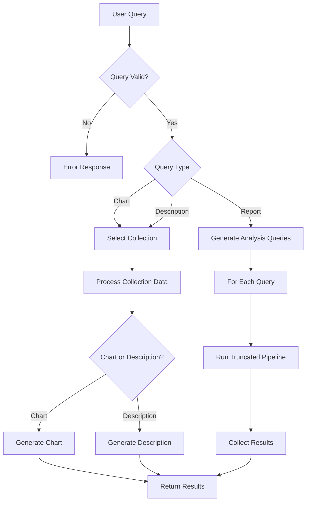
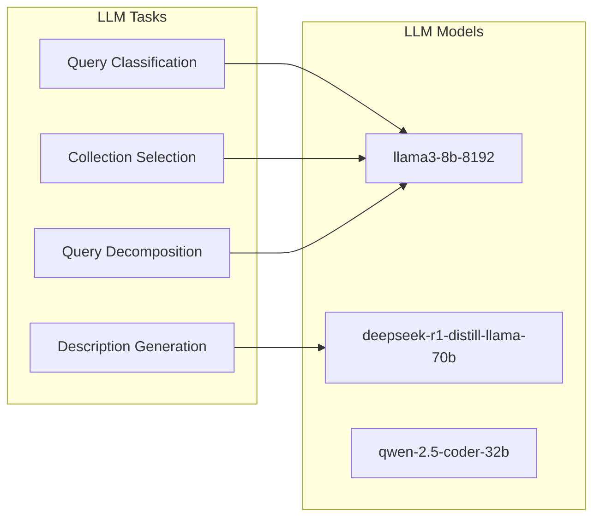

# System Architecture

This document provides a comprehensive overview of the LLM-Powered Analytics Backend architecture, including component relationships, data flow, and design principles.

## System Overview

The LLM-Powered Analytics Backend is designed to process natural language queries about data, perform appropriate analysis, and return meaningful insights in various formats (charts, descriptions, or comprehensive reports). The system leverages Large Language Models (LLMs) to understand user queries and guide the analytics process.

### High-Level Architecture

## Core Components

### API Layer (`app.py`)

The API layer provides HTTP endpoints for client applications to interact with the system:

- `/api/query` (POST): Processes analytical queries and returns results
- `/api/health` (GET): Checks system health, including database connectivity

### Pipeline Orchestration (`pipeline.py`)

The main pipeline orchestrates the data flow through the system, handling:

1. Query validation
2. Query classification
3. Collection selection
4. Data processing
5. Result generation

### Processing Modules

#### Query Processor (`a_query_processor`)

Handles query validation and classification:

- `query_validator.py`: Ensures queries are well-formed and processable
- `query_classifier.py`: Categorizes queries as chart, description, or report requests

#### Data Processor (`b_data_processor`)

Manages data selection and processing:

- `collection_selector.py`: Determines which data collection to use for a query
- `collection_processor.py`: Retrieves and processes data from MongoDB

#### Regular Generator (`c_regular_generator`)

Generates standard outputs for simple queries:

- `chart_generator.py`: Creates visual representations of data
- `description_generator.py`: Produces textual analysis of data

#### Report Generator (`d_report_generator`)

Handles complex queries requiring multi-step analysis:

- `report_generator.py`: Orchestrates the report generation process
- `generate_analysis_queries.py`: Breaks down complex queries into individual analysis tasks
- `truncated_pipeline.py`: Processes individual analysis queries within a report

### Utilities (`utils`)

Supporting components and services:

- `database.py`: MongoDB connection and operations
- `llm_config.py`: LLM service configuration
- `logging_config.py`: Centralized logging setup
- `schema.py`: Data schema definitions

## Data Flow

## LLM Integration

The system uses LLMs provided by Groq for several critical tasks:

1. Query classification
2. Determining relevant data collections
3. Breaking down complex report queries
4. Generating natural language descriptions

## Security Model

The system implements several security measures:

1. Collection access restrictions (RESTRICTED_COLLECTIONS in database.py)
2. Input validation using Pydantic models
3. Environment-based configuration for sensitive parameters
4. Error handling to prevent information leakage

## Design Principles

The architecture follows these key design principles:

1. **Modularity**: Each component has a clear, distinct responsibility
2. **Pipeline Processing**: Data flows through well-defined stages
3. **Error Isolation**: Errors in one stage don't crash the entire system
4. **Configurability**: System behavior can be adjusted through configuration
5. **Testability**: Components can be tested in isolation
