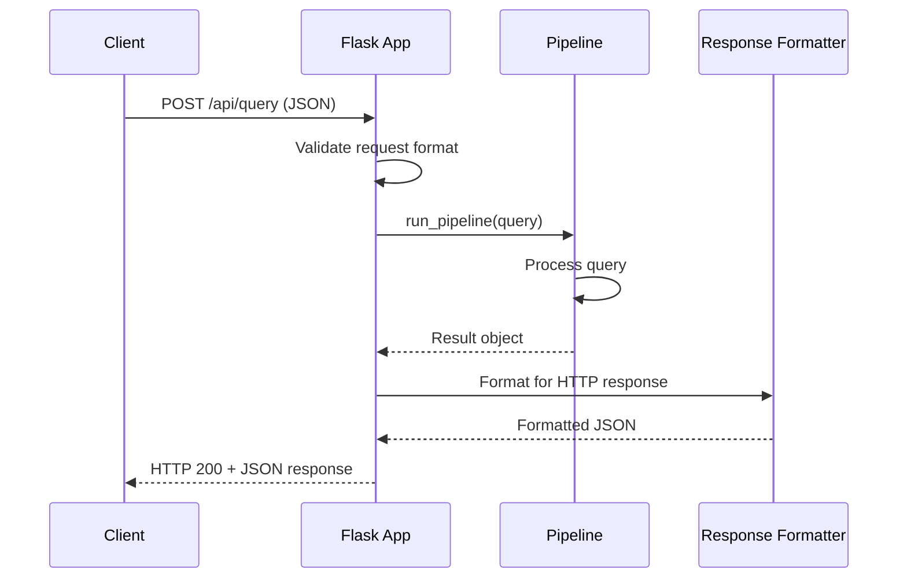

# API Reference

This document provides detailed information about the REST API endpoints exposed by the LLM-Powered Analytics Backend, including request/response formats, authentication, error handling, and examples.

## Base URL

All API endpoints are relative to the base URL of your deployed instance:

```
http://{host}:{port}/api
```

For local development, this is typically:

```
http://localhost:5000/api
```

## Authentication

The current implementation does not include authentication mechanisms. For production deployments, it is recommended to implement API keys or OAuth2 authentication.

## Endpoints

### Process Query

```
POST /query
```

This endpoint processes natural language analytical queries and returns results based on the query type (chart, description, or report).

#### Request Format

```json
{
  "query": "string"
}
```

| Parameter | Type   | Required | Description                           |
| --------- | ------ | -------- | ------------------------------------- |
| query     | string | Yes      | The natural language query to process |

#### Response Format

For successful requests, the HTTP response code is `200 OK` with a JSON response body:

```json
{
  "output": {
    "type": "string",
    "result": "string | base64-encoded data"
  },
  "original_query": "string"
}
```

| Field          | Type                          | Description                                               |
| -------------- | ----------------------------- | --------------------------------------------------------- |
| output.type    | string                        | Result type: "chart", "description", "report", or "error" |
| output.result  | string \| base64-encoded data | The result content, which varies by type                  |
| original_query | string                        | The original query that was processed                     |

For report results, the output format is slightly different:

```json
{
  "output": {
    "type": "report",
    "result": {
      "results": ["string | base64-encoded data", ...]
    }
  },
  "original_query": "string"
}
```

#### Result Types

- **chart**: The result is a base64-encoded PNG image of the chart
- **description**: The result is a text description of the data analysis
- **report**: The result contains an array of mixed content (text and/or base64-encoded images)
- **error**: The result is an error message

#### Error Responses

| HTTP Code | Description                       | Response Body                           |
| --------- | --------------------------------- | --------------------------------------- |
| 400       | Bad Request - Invalid input       | `{"error": "Request must be JSON"}`     |
| 400       | Bad Request - Missing query field | `{"error": "Query field is required"}`  |
| 500       | Internal Server Error             | `{"error": "Error message details..."}` |

#### Example Requests

**Simple Description Query:**

```json
{
  "query": "What is the total ad spend by country?"
}
```

**Chart Query:**

```json
{
  "query": "Generate a bar chart of revenue by channel"
}
```

**Report Query:**

```json
{
  "query": "Create a comprehensive marketing performance report for Q2"
}
```

#### Example Responses

**Description Response:**

```json
{
  "output": {
    "type": "description",
    "result": "The total ad spend by country is as follows:\n\nUSA: $1,245,678\nUK: $890,123\nGermany: $567,890\nFrance: $432,109\nJapan: $321,098\n\nThe USA has the highest ad spend, accounting for 36% of total global spend."
  },
  "original_query": "What is the total ad spend by country?"
}
```

**Chart Response:**

```json
{
  "output": {
    "type": "chart",
    "result": "iVBORw0KGgoAAAANSUhEUgAAA+gAAAPoCAIAAADCwUOzAAAgA..." // Base64 encoded PNG
  },
  "original_query": "Generate a bar chart of revenue by channel"
}
```

**Report Response:**

```json
{
  "output": {
    "type": "report",
    "result": {
      "results": [
        "# Q2 Marketing Performance Report\n\n## Executive Summary\n\nIn Q2, overall marketing performance improved by 15% compared to Q1...",
        "data:image/png;base64,iVBORw0KGgoAAAANSUhEUgAAA+gAAAPoCAIAAADCwUOzAAAgA...", // Chart 1
        "## Channel Performance\n\nFacebook continues to be our best performing channel with a 3.2 ROAS...",
        "data:image/png;base64,R0lGODlhAQABAIAAAAAAAP///yH5BAEAAAAALAAAAAABAAEAAAIBRAA7..." // Chart 2
      ]
    }
  },
  "original_query": "Create a comprehensive marketing performance report for Q2"
}
```

### Health Check

```
GET /health
```

This endpoint provides health status information about the application and its dependencies.

#### Request Format

No request body is required.

#### Response Format

For a healthy system, the HTTP response code is `200 OK` with a JSON response body:

```json
{
  "status": "ok",
  "message": "Database is healthy and collections exist",
  "healthy": true,
  "collections_count": 5
}
```

For an unhealthy system, the HTTP response code is `503 Service Unavailable` with a JSON response body:

```json
{
  "status": "error",
  "message": "Error message details...",
  "healthy": false
}
```

| Field             | Type    | Description                                   |
| ----------------- | ------- | --------------------------------------------- |
| status            | string  | "ok" or "error"                               |
| message           | string  | Human-readable status message                 |
| healthy           | boolean | Whether the system is functioning properly    |
| collections_count | integer | Number of accessible collections (if healthy) |

## Implementation Details

### Request Processing

The API endpoints are implemented in `app.py` using Flask. The main query processing flow is:



### Error Handling

The API implements comprehensive error handling, including:

1. Request validation (JSON format, required fields)
2. Process monitoring and timeout handling
3. Exception catching and appropriate error responses

### Response Formatting

For chart results, binary image data is Base64-encoded before inclusion in the JSON response.

For report results, the system differentiates between text content and binary image data, with images being prefixed with `data:image/png;base64,` to facilitate display in web applications.

## Code Reference

**Main API Handler (`app.py`):**

```python
@app.route("/api/query", methods=["POST"])
def process_query():
    # Validate that the request contains JSON
    if not request.is_json:
        return jsonify({"error": "Request must be JSON"}), 400

    # Extract and validate the query field
    data = request.get_json()
    if "query" not in data:
        return jsonify({"error": "Query field is required"}), 400

    query = data["query"]
    logger.info(f"Received query: '{query}'")

    # Process the query through the pipeline
    try:
        result: Dict[str, Union[str, bytes, ReportResults]] = run_pipeline(query)

        # Process results based on type
        # ...

        response = {"output": result, "original_query": query}
        return jsonify(response)
    except Exception as e:
        return jsonify({"error": str(e)}), 500
```
