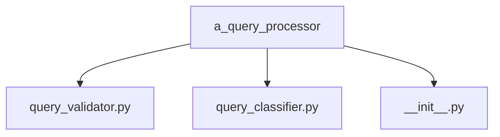
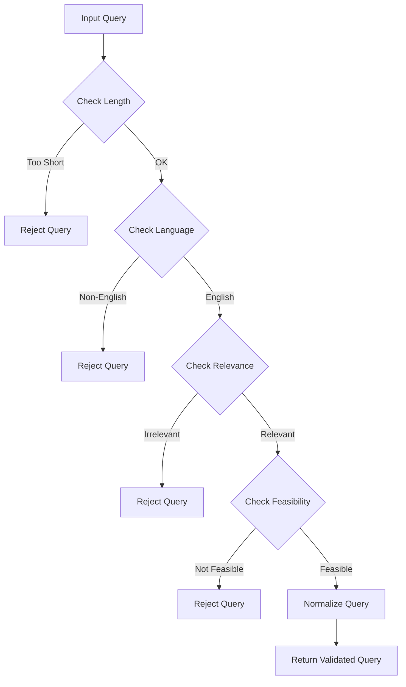
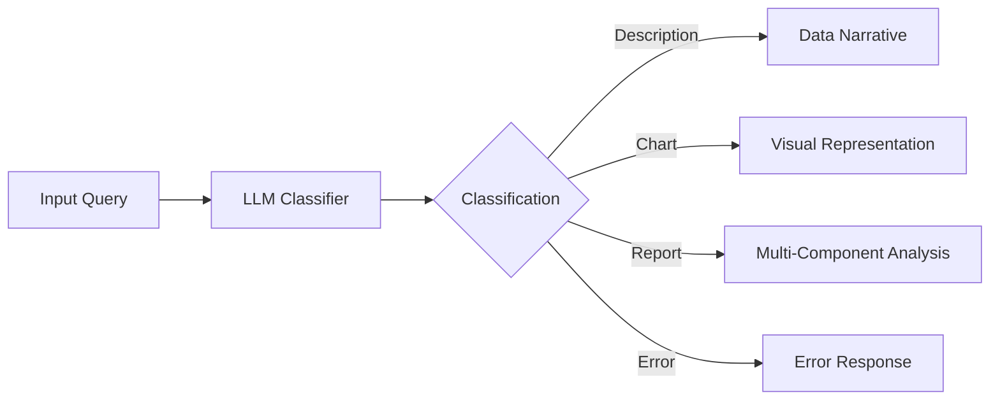
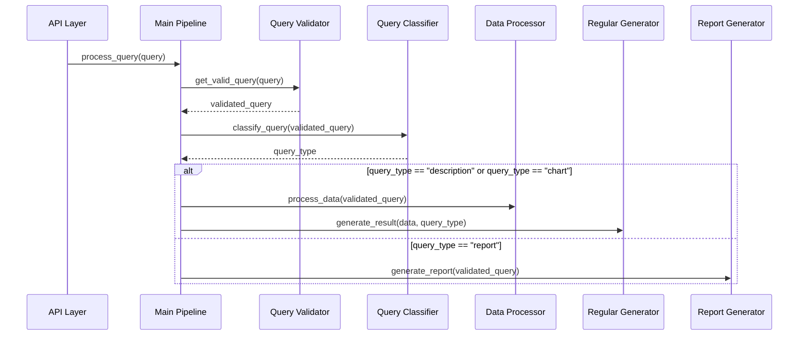

# Query Processor

The Query Processor module is responsible for validating and classifying user queries in the LLM-Powered Analytics Backend system. It ensures that incoming queries are well-formed and categorizes them into appropriate types for downstream processing.

## Module Structure



## Core Components

### Query Validator (`query_validator.py`)

The Query Validator ensures that incoming queries are well-formed, meaningful, and processable. It rejects queries that are ambiguous, malformed, or outside the system's capabilities.

#### Key Functions

```python
def get_valid_query(query: str) -> str:
    """
    Validates and normalizes a user query.

    Args:
        query: The raw query string from the user

    Returns:
        A normalized, validated query string

    Raises:
        ValueError: If the query is invalid or cannot be processed
    """
```

#### Validation Process



#### Implementation Details

The validator uses a Groq LLM to assess query validity. It sends the query to the LLM along with validation criteria and parses the response to determine if the query is valid.

The prompt instructs the LLM to check for:

- Relevance to marketing/analytics data
- Clarity and specificity
- Feasibility given available data
- Appropriate scope

If a query fails validation, the system returns a clear error message explaining why the query cannot be processed.

### Query Classifier (`query_classifier.py`)

The Query Classifier categorizes valid queries into specific types that determine how they will be processed by the system.

#### Key Classes and Functions

```python
class QueryTypeEnum(str, Enum):
    """
    Enumeration of possible query types that can be classified.
    """
    DESCRIPTION = "description"
    REPORT = "report"
    CHART = "chart"
    ERROR = "error"

class QueryType(BaseModel):
    """
    Pydantic model representing the classification result.
    """
    query_type: QueryTypeEnum

def classify_query(user_query: str) -> str:
    """
    Public function to classify a user query into one of the predefined types.

    Args:
        user_query: The raw query text from the user

    Returns:
        String representation of the query type (description, report, chart, or error)

    Raises:
        Exception: If there is an error in the classification process
    """
```

#### Classification Process



#### Query Types

1. **Description**: Queries asking for specific details, explanations, or summaries about particular aspects of the data.

   - Example: "What is the total ad spend by country?"
   - Processing: Generate a textual analysis of the specific data point

2. **Chart**: Queries specifically requesting visual representation or graphs of data.

   - Example: "Show me a bar chart of revenue by channel"
   - Processing: Generate a chart visualization of the relevant data

3. **Report**: Queries requesting comprehensive analysis across multiple datasets.

   - Example: "Create a full marketing report for all channels in Q2"
   - Processing: Break down into multiple analysis tasks and generate a combined report

4. **Error**: For ambiguous, unclear queries that passed validation but cannot be clearly classified.
   - Example: "Show me data in a nice way"
   - Processing: Return an error response asking for clarification

#### Implementation Details

The classifier uses a Groq LLM with a few-shot learning approach, providing examples of each query type to help the model accurately classify new queries.

The implementation:

1. Prepares the query and example prompt
2. Sends the prompt to the LLM
3. Extracts and normalizes the classification from the response
4. Returns the classification as a string

## Interaction with Other Components

The Query Processor components interact with other parts of the system as follows:



## Error Handling

The Query Processor implements comprehensive error handling:

1. **Validation Errors**: Clearly communicates why a query is invalid
2. **Classification Errors**: Defaults to "error" type when classification is uncertain
3. **Processing Errors**: Captures and logs exceptions during processing

## Configuration

The Query Processor uses models specified in `llm_config.py`:

```python
VALIDATOR_MODEL = "llama3-8b-8192"
CLASSIFIER_MODEL = "llama3-8b-8192"
```

These models can be configured to use different LLMs based on performance needs.

## Example Usage

```python
from mypackage.a_query_processor import query_validator, query_classifier

# Validate a query
try:
    validated_query = query_validator.get_valid_query("Show me ad spend by country")
    print(f"Query is valid: {validated_query}")
except ValueError as e:
    print(f"Query validation failed: {str(e)}")

# Classify a query
try:
    query_type = query_classifier.classify_query("Generate a bar chart of revenue by month")
    print(f"Query classified as: {query_type}")
except Exception as e:
    print(f"Classification failed: {str(e)}")
```

## Performance Considerations

- **Caching**: Consider implementing a cache for common query validations and classifications
- **Timeout Handling**: Include proper timeout handling for LLM API calls
- **Error Resilience**: Implement retries for transient errors in LLM API calls
