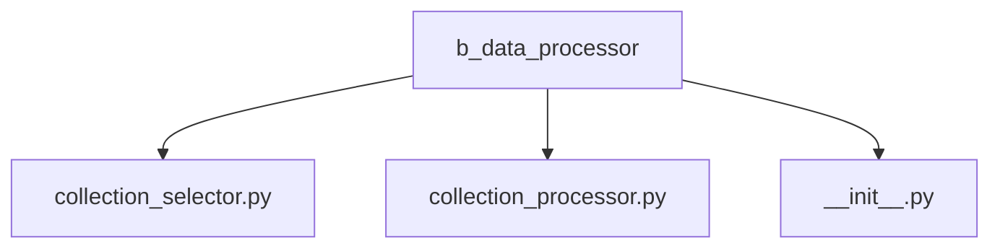
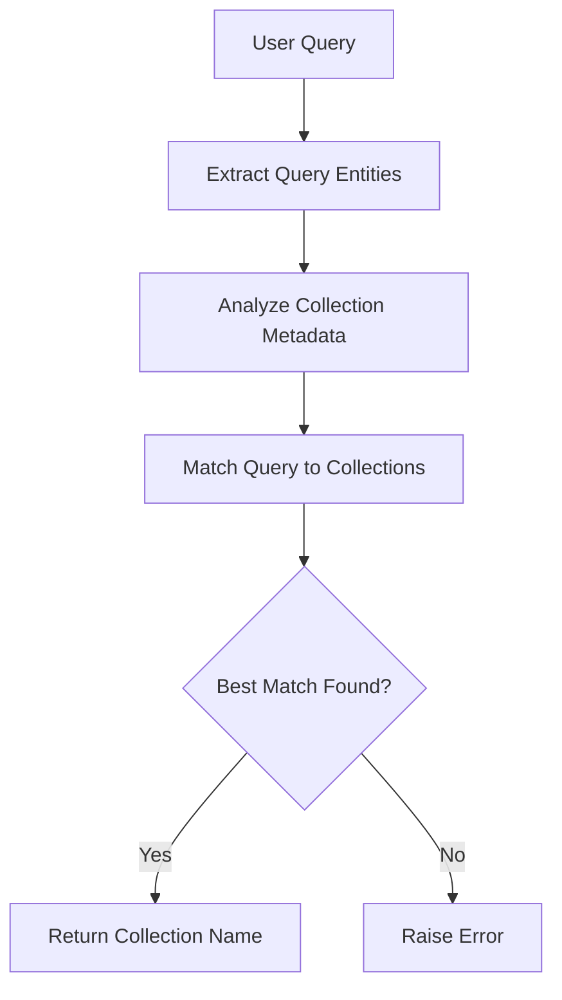
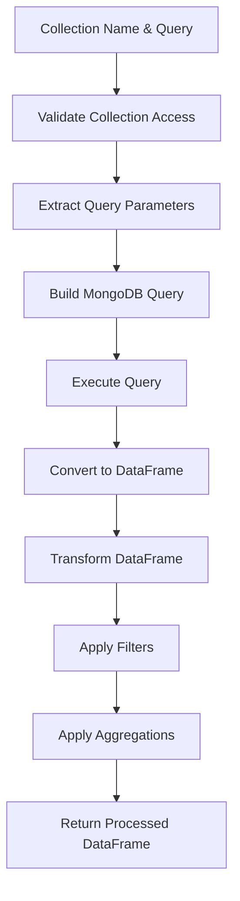
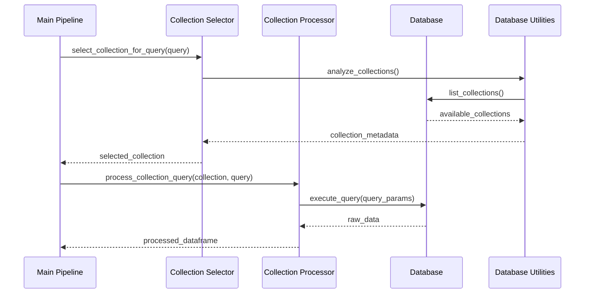

# Data Processor

The Data Processor module is responsible for identifying relevant data sources and retrieving/transforming data based on user queries. It acts as the bridge between natural language queries and structured data in the database.

## Module Structure



## Core Components

### Collection Selector (`collection_selector.py`)

The Collection Selector determines which MongoDB collection is most appropriate for a given user query, using LLM-based reasoning to match query intent with available data collections.

#### Key Functions

```python
def select_collection_for_query(query: str) -> str:
    """
    Determines the most appropriate collection to use for a given query.

    Args:
        query: The validated user query

    Returns:
        The name of the selected collection

    Raises:
        ValueError: If no suitable collection can be found
    """
```

#### Selection Process



#### Implementation Details

The collection selector uses a multi-stage process:

1. **Collection Analysis**: Retrieves metadata about all accessible collections, including field names, types, and sample values
2. **Query Analysis**: Uses an LLM to extract key entities, metrics, and time periods from the query
3. **Matching**: Compares query requirements with collection capabilities
4. **Selection**: Chooses the best collection based on field availability and data relevance

The collection selector maintains a blacklist of restricted collections (`RESTRICTED_COLLECTIONS` in `database.py`) that cannot be accessed, ensuring data security.

### Collection Processor (`collection_processor.py`)

The Collection Processor retrieves data from the selected collection and transforms it into a pandas DataFrame suitable for analysis based on the query.

#### Key Functions

```python
def process_collection_query(collection_name: str, query: str) -> pd.DataFrame:
    """
    Processes a query against a specific collection, retrieving and transforming
    the data into a DataFrame.

    Args:
        collection_name: The name of the collection to query
        query: The validated user query

    Returns:
        A pandas DataFrame containing the processed data

    Raises:
        ValueError: If the collection cannot be accessed or processed
        DataFrameError: If the data cannot be transformed into a suitable DataFrame
    """
```

#### Processing Flow



#### Query Parameter Extraction

The collection processor uses an LLM to extract query parameters:

1. **Fields**: Which columns/fields to include in the result
2. **Filters**: Conditions to filter the data (e.g., date ranges, categories)
3. **Aggregations**: How to group and aggregate the data (e.g., sum, average, count)
4. **Sorting**: How to order the results
5. **Limits**: Maximum number of records to return

#### DataFrame Transformations

The processor applies several transformations to prepare the data:

1. **Type Conversion**: Ensuring dates, numbers, and categories have appropriate types
2. **Null Handling**: Managing missing values through imputation or filtering
3. **Derived Columns**: Creating calculated fields based on the query requirements
4. **Normalization**: Scaling numerical values when needed

## Data Schema

The system is designed to work with various data schemas, but primarily expects collections related to marketing analytics:

### Sample Collection Schema: `campaign_performance`

| Field        | Type   | Description                                |
| ------------ | ------ | ------------------------------------------ |
| date         | Date   | The date of the performance record         |
| campaign_id  | String | Unique identifier for the campaign         |
| channel      | String | Marketing channel (e.g., Facebook, Google) |
| age_group    | String | Target audience age group                  |
| ad_spend     | Number | Amount spent on advertising                |
| views        | Number | Number of ad views/impressions             |
| leads        | Number | Number of leads generated                  |
| new_accounts | Number | Number of new accounts created             |
| country      | String | Country targeted by the campaign           |
| revenue      | Number | Revenue attributed to the campaign         |

## MongoDB Integration

The Data Processor leverages MongoDB's query capabilities for efficient data retrieval:

```python
def build_mongodb_query(parameters: Dict[str, Any]) -> Dict[str, Any]:
    """
    Builds a MongoDB query from extracted parameters.

    Args:
        parameters: Dictionary of query parameters

    Returns:
        A MongoDB query document
    """
    query = {}

    # Add filters
    if "filters" in parameters:
        for field, condition in parameters["filters"].items():
            if isinstance(condition, dict):
                # Handle operators like $gt, $lt, etc.
                query[field] = condition
            else:
                # Exact match
                query[field] = condition

    return query
```

## Interaction with Other Components

The Data Processor interfaces with other system components as follows:



## Error Handling

The Data Processor implements robust error handling:

1. **Collection Access**: Verifies that the requested collection exists and is accessible
2. **Query Construction**: Validates that the MongoDB query is well-formed
3. **Data Retrieval**: Handles timeouts and connection issues
4. **Data Processing**: Catches and reports transformation errors
5. **Edge Cases**: Manages empty results and unexpected data formats

## Performance Optimization

The Data Processor includes several optimizations:

1. **Query Projection**: Only retrieves needed fields from MongoDB
2. **Batch Processing**: Processes large datasets in chunks
3. **Indexing Awareness**: Constructs queries to leverage existing MongoDB indexes
4. **Result Limiting**: Applies limits to prevent memory issues with large datasets

## Example Usage

```python
from mypackage.b_data_processor import collection_selector, collection_processor

# Select collection
try:
    collection = collection_selector.select_collection_for_query(
        "What was our ad spend by channel last month?"
    )
    print(f"Selected collection: {collection}")

    # Process query
    df = collection_processor.process_collection_query(
        collection,
        "What was our ad spend by channel last month?"
    )

    print(f"Retrieved data with shape: {df.shape}")
    print(df.head())
except Exception as e:
    print(f"Error processing data: {str(e)}")
```

## Configuration

The Data Processor uses the following configurations:

```python
# From llm_config.py
COLLECTION_SELECTOR_MODEL = "llama3-8b-8192"
COLLECTION_PROCESSOR_MODEL = "qwen-2.5-coder-32b"

# From database.py
RESTRICTED_COLLECTIONS = ["users", "prophet_predictions"]
```

These settings can be adjusted based on performance requirements and security considerations.
