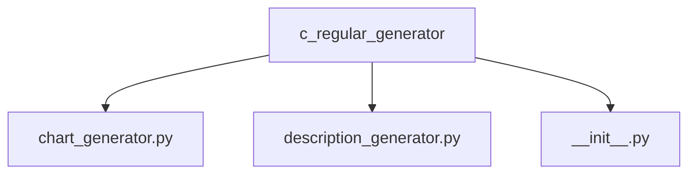
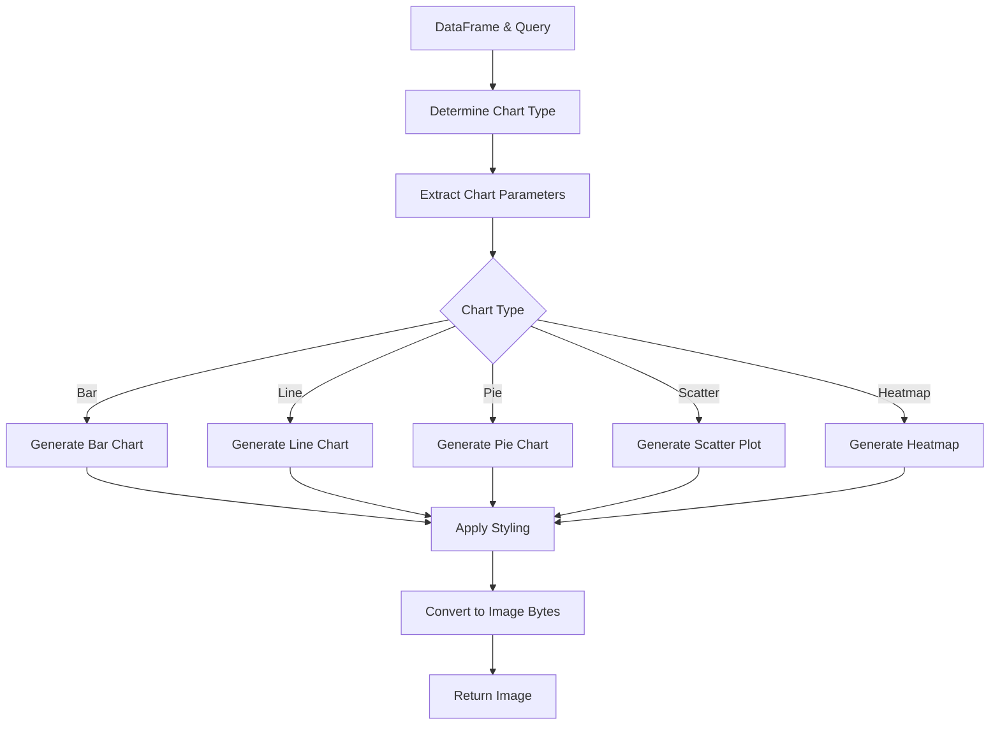
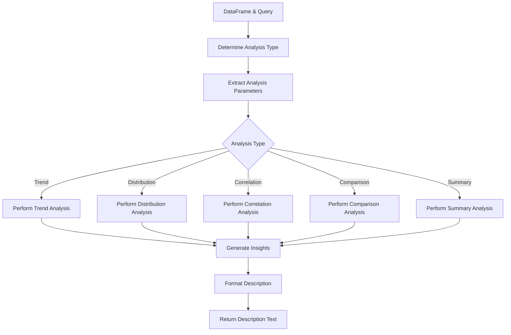
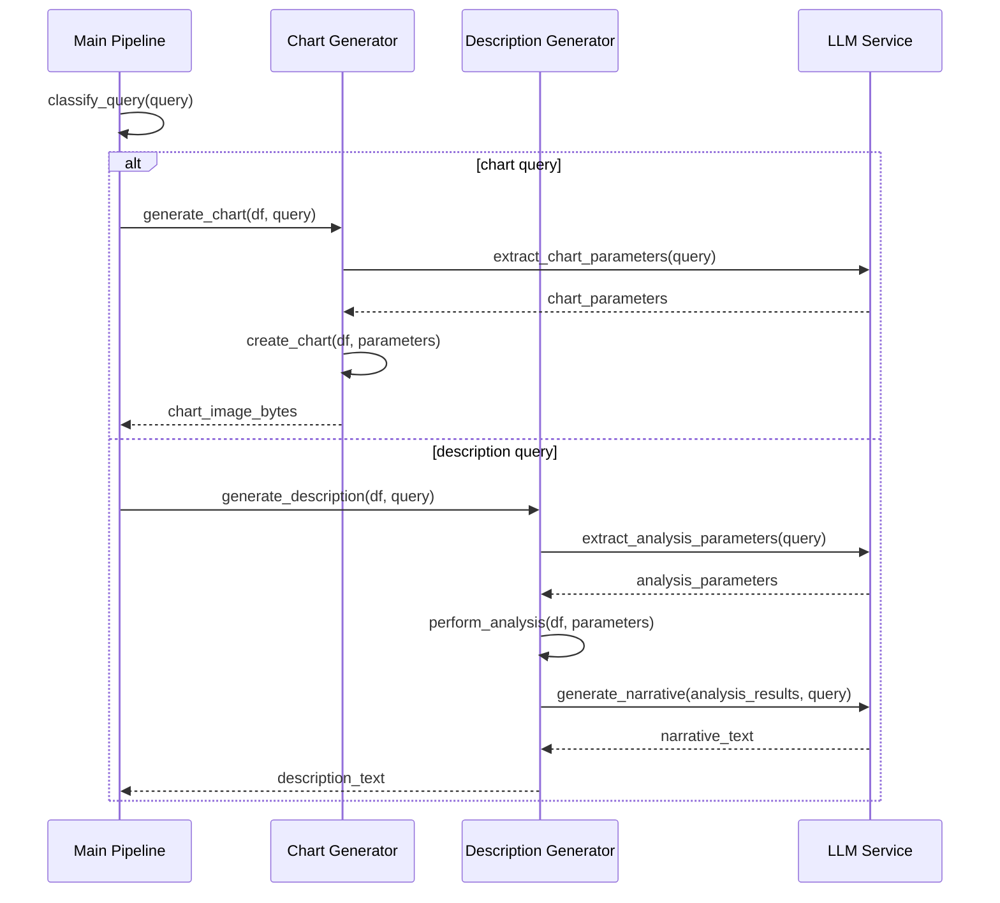

# Regular Generator

The Regular Generator module is responsible for producing standard outputs from processed data, including visual charts and textual descriptions. It handles the final stage of processing for non-report queries, transforming structured data into human-friendly insights.

## Module Structure



## Core Components

### Chart Generator (`chart_generator.py`)

The Chart Generator creates visual representations of data in response to chart-specific queries, using matplotlib and seaborn to generate appropriate visualizations based on the query intent and data characteristics.

#### Key Functions

```python
def generate_chart(df: pd.DataFrame, query: str) -> bytes:
    """
    Generate a chart visualization from a DataFrame based on the query.

    Args:
        df: The processed pandas DataFrame containing the data to visualize
        query: The validated user query

    Returns:
        Bytes containing the PNG image of the generated chart

    Raises:
        ValueError: If the chart type cannot be determined or generated
    """
```

#### Chart Generation Process



#### Supported Chart Types

The Chart Generator can produce various visualization types:

1. **Bar Charts**: For comparing categories (vertical or horizontal)
2. **Line Charts**: For time series and trend analysis
3. **Pie/Donut Charts**: For part-to-whole relationships
4. **Scatter Plots**: For correlation analysis
5. **Heatmaps**: For multi-dimensional data visualization
6. **Box Plots**: For distribution analysis
7. **Area Charts**: For cumulative totals over time
8. **Combined Charts**: Multiple chart types on the same visualization

#### Chart Parameter Extraction

The generator uses an LLM to extract chart-specific parameters from the query:

- **Chart Type**: The type of visualization to generate
- **X-Axis/Y-Axis**: Which fields to use for the axes
- **Grouping**: How to segment the data
- **Aggregation**: How to aggregate the data (sum, average, etc.)
- **Color Scheme**: Which colors to use for the visualization
- **Title/Labels**: Text for the chart title and axis labels

#### Implementation Examples

```python
def create_bar_chart(df: pd.DataFrame, params: Dict[str, Any]) -> plt.Figure:
    """
    Create a bar chart based on the specified parameters.

    Args:
        df: The DataFrame containing the data
        params: Dictionary of chart parameters

    Returns:
        Matplotlib Figure object containing the chart
    """
    fig, ax = plt.subplots(figsize=(10, 6))

    # Extract parameters
    x_column = params.get("x_column")
    y_column = params.get("y_column")
    title = params.get("title", f"{y_column} by {x_column}")

    # Create the bar chart
    sns.barplot(data=df, x=x_column, y=y_column, ax=ax)

    # Set title and labels
    ax.set_title(title)
    ax.set_xlabel(params.get("x_label", x_column))
    ax.set_ylabel(params.get("y_label", y_column))

    # Additional styling
    plt.tight_layout()

    return fig
```

### Description Generator (`description_generator.py`)

The Description Generator creates textual narratives and insights from data in response to description-specific queries, using statistical analysis and LLM-based natural language generation.

#### Key Functions

```python
def generate_description(df: pd.DataFrame, query: str) -> str:
    """
    Generate a textual description of the data based on the query.

    Args:
        df: The processed pandas DataFrame containing the data to analyze
        query: The validated user query

    Returns:
        A string containing the generated description

    Raises:
        ValueError: If the description cannot be generated
    """
```

#### Description Generation Process



#### Analysis Types

The Description Generator supports various analysis types:

1. **Trend Analysis**: Identifying patterns over time
2. **Distribution Analysis**: Describing data distributions and outliers
3. **Correlation Analysis**: Identifying relationships between variables
4. **Comparison Analysis**: Comparing different categories or segments
5. **Summary Analysis**: Providing high-level overview of the data

#### Statistical Analysis

For each analysis type, the generator performs appropriate statistical calculations:

- **Descriptive Statistics**: Mean, median, mode, min, max, standard deviation
- **Trend Detection**: Linear regression, moving averages, seasonality analysis
- **Outlier Detection**: Z-score analysis, IQR-based detection
- **Correlation Analysis**: Pearson/Spearman correlation coefficients
- **Significance Testing**: T-tests, chi-square tests, ANOVA

#### LLM-Based Narrative Generation

After performing statistical analysis, the generator uses an LLM to convert the statistical insights into natural language:

1. The statistical results are formatted as a structured context
2. This context is sent to the LLM along with the original query
3. The LLM generates a coherent narrative describing the insights
4. The narrative is post-processed to ensure accuracy and readability

#### Implementation Example

```python
def analyze_trend(df: pd.DataFrame, time_column: str, value_column: str) -> Dict[str, Any]:
    """
    Perform trend analysis on a time series.

    Args:
        df: The DataFrame containing the data
        time_column: The column containing time/date values
        value_column: The column containing the values to analyze

    Returns:
        Dictionary of trend analysis results
    """
    # Ensure data is sorted by time
    df = df.sort_values(by=time_column)

    # Calculate basic trend metrics
    first_value = df[value_column].iloc[0]
    last_value = df[value_column].iloc[-1]
    change = last_value - first_value
    pct_change = (change / first_value) * 100 if first_value != 0 else float('inf')

    # Linear regression for trend line
    x = np.arange(len(df))
    slope, intercept, r_value, p_value, std_err = stats.linregress(x, df[value_column])

    return {
        "first_value": first_value,
        "last_value": last_value,
        "change": change,
        "percent_change": pct_change,
        "trend_direction": "upward" if slope > 0 else "downward",
        "trend_strength": abs(r_value),
        "p_value": p_value,
        "significant": p_value < 0.05
    }
```

## Integration with the Pipeline

The Regular Generator integrates with the main pipeline as follows:



## Error Handling

The Regular Generator implements comprehensive error handling:

1. **Data Validation**: Checks that the DataFrame contains the required columns
2. **Parameter Validation**: Ensures that extracted parameters are valid
3. **Chart Type Selection**: Falls back to appropriate chart types if the requested type is unsuitable
4. **Error Messages**: Provides clear error messages when generation fails
5. **Fallback Generation**: Implements fallback strategies for partial failures

## Visualization Styling

The Chart Generator applies consistent styling to ensure readability and visual appeal:

1. **Color Schemes**: Uses color-blind friendly palettes
2. **Font Sizes**: Ensures text is legible at various display sizes
3. **Legends**: Includes informative legends for multi-series charts
4. **Annotations**: Adds annotations for key data points where appropriate
5. **Grid Lines**: Configures grid lines for better readability

## Example Usage

```python
from mypackage.c_regular_generator import chart_generator, description_generator
import pandas as pd

# Sample DataFrame
data = {
    'date': pd.date_range(start='2023-01-01', periods=12, freq='M'),
    'channel': ['Facebook'] * 6 + ['Google'] * 6,
    'ad_spend': [1000, 1200, 1100, 1300, 1500, 1600, 800, 900, 950, 1000, 1100, 1200],
    'revenue': [3000, 3600, 3300, 3900, 4500, 4800, 2400, 2700, 2850, 3000, 3300, 3600]
}
df = pd.DataFrame(data)

# Generate a chart
try:
    chart_bytes = chart_generator.generate_chart(
        df,
        "Create a line chart showing ad spend by channel over time"
    )
    with open('ad_spend_chart.png', 'wb') as f:
        f.write(chart_bytes)
    print("Chart saved to ad_spend_chart.png")
except Exception as e:
    print(f"Error generating chart: {str(e)}")

# Generate a description
try:
    description = description_generator.generate_description(
        df,
        "Analyze the trend of ad spend and revenue by channel"
    )
    print(description)
except Exception as e:
    print(f"Error generating description: {str(e)}")
```

## Configuration

The Regular Generator uses the following configurations:

```python
# From llm_config.py
DESCRIPTION_GENERATOR_MODEL = "deepseek-r1-distill-llama-70b"
CHART_DATA_MODEL = "llama3-8b-8192"

# Default chart configurations
DEFAULT_FIGURE_SIZE = (10, 6)  # inches
DEFAULT_DPI = 100
DEFAULT_FONT_SIZE = 12
COLOR_PALETTE = "Set2"  # seaborn color palette
```

These settings can be adjusted based on output quality requirements and performance considerations.
