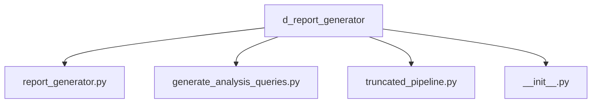
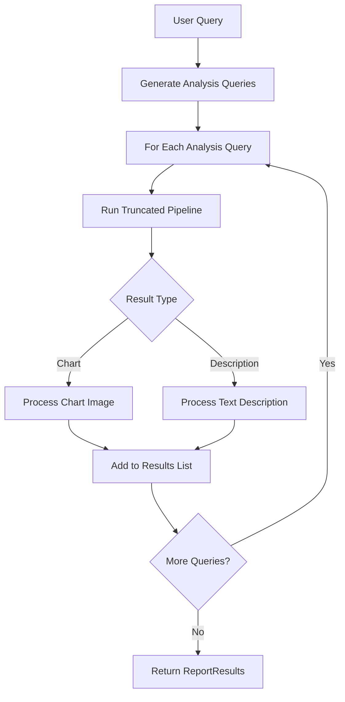
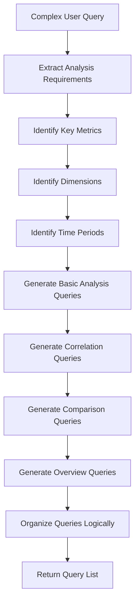
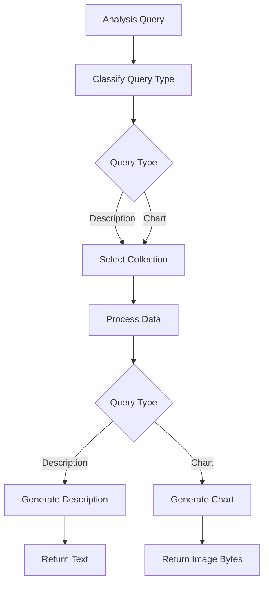
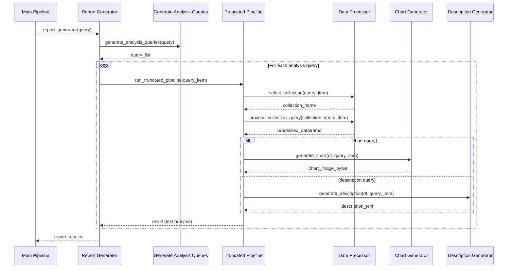

# Report Generator

The Report Generator module is responsible for handling complex analytical queries that require multi-part analysis. It breaks down complex queries into smaller, more focused analysis tasks, processes each one individually, and combines the results into a comprehensive report.

## Module Structure



## Core Components

### Report Generator (`report_generator.py`)

The Report Generator orchestrates the entire report generation process, from decomposing the initial query to collecting and structuring the final results.

#### Key Classes and Functions

```python
class ReportResults(BaseModel):
    """
    Pydantic model to store and structure the results of report generation.
    """
    results: List[Union[str, bytes]]

def report_generator(user_query: str) -> ReportResults:
    """
    Generate a comprehensive report by breaking down a complex query
    into smaller analysis tasks and executing each task.

    Args:
        user_query: The original user query requesting a report

    Returns:
        ReportResults object containing all analysis results

    Raises:
        Exception: If report generation fails
    """
```

#### Report Generation Process



#### Implementation Details

The `report_generator` function orchestrates the report generation process:

1. It receives a complex query requiring multi-part analysis
2. It uses `generate_analysis_queries` to break down the query
3. For each resulting query, it executes the `run_truncated_pipeline` function
4. It collects each result (text or image) into a `ReportResults` object
5. The final `ReportResults` object contains a list of alternating text descriptions and charts

### Query Generation (`generate_analysis_queries.py`)

This component analyzes a complex query and breaks it down into a structured set of simpler analysis queries that together address the original question.

#### Key Classes and Functions

```python
class QueryType(str, Enum):
    """
    Enumeration of analysis query types.
    """
    DESCRIPTION = "description"
    CHART = "chart"

class QueryItem(str):
    """
    String-based type representing an individual analysis query.
    """

class QueryList(BaseModel):
    """
    Pydantic model representing a list of analysis queries.
    """
    queries: List[QueryItem]

def generate_analysis_queries(user_query: str) -> QueryList:
    """
    Break down a complex query into a list of focused analysis queries.

    Args:
        user_query: The complex user query to decompose

    Returns:
        QueryList containing the generated analysis queries

    Raises:
        Exception: If query decomposition fails
    """
```

#### Query Decomposition Process



#### Implementation Details

The query decomposition process uses an LLM to analyze the complex query and identify:

1. **Key Metrics**: The primary measures to be analyzed (e.g., revenue, ad spend)
2. **Dimensions**: The categorical variables to segment by (e.g., channel, country)
3. **Time Periods**: The relevant time ranges for analysis
4. **Required Analyses**: The types of analyses needed (trends, comparisons, distributions)

Based on this analysis, it generates a structured set of individual queries that together provide a comprehensive answer to the original question.

### Truncated Pipeline (`truncated_pipeline.py`)

This specialized pipeline processes individual analysis queries within a report context, a streamlined version of the main pipeline optimized for report generation.

#### Key Functions

```python
def run_truncated_pipeline(query: str) -> Union[str, bytes]:
    """
    Execute a specialized pipeline for processing a single analysis query
    within a report context.

    Args:
        query: The individual analysis query to process

    Returns:
        Either a string containing text description or bytes containing a chart image

    Raises:
        Exception: If processing fails
    """
```

#### Truncated Pipeline Flow



#### Implementation Details

The truncated pipeline is optimized for report generation:

1. It focuses on one specific analysis task at a time
2. It reuses collection selection from the main query where possible
3. It handles both description and chart generation in a unified flow
4. It returns raw results (text or image bytes) directly to the report generator

## Report Structure and Content

The report generator creates comprehensive reports that typically include:

1. **Executive Summary**: High-level overview of key findings
2. **Detailed Analysis Sections**: Organized by topic or metric
3. **Visual Elements**: Charts illustrating key trends and patterns
4. **Textual Insights**: Descriptions explaining the significance of findings
5. **Comparative Analysis**: Contrasting different segments or time periods

The content and structure are dynamically determined based on the user's query and the available data.

## Interaction with Other Components

The Report Generator interacts with other components as follows:



## Error Handling

The Report Generator implements robust error handling to ensure that failures in individual analysis tasks don't prevent the overall report generation:

1. **Query Generation Failures**: If query decomposition fails, returns a clear error message
2. **Individual Analysis Failures**: Adds error messages to the report instead of failing completely
3. **Empty Results Handling**: Detects and handles cases where no meaningful results are found
4. **Timeout Management**: Implements timeouts for long-running analyses

## Report Result Structure

The `ReportResults` class contains a list of analysis results that can be either:

- **Text Descriptions**: Strings containing narrative analysis
- **Chart Images**: Binary data (bytes) containing PNG images

The client application can interpret these results to build a rich, interactive report display, typically rendering the text as formatted content and displaying the images as embedded charts.

## Example Usage

```python
from mypackage.d_report_generator import report_generator

try:
    # Generate a comprehensive report
    report_results = report_generator(
        "Create a detailed marketing report analyzing performance by channel,
         focusing on ROI trends and identifying the best performing campaigns."
    )

    print(f"Generated report with {len(report_results.results)} components")

    # Process the results
    for i, result in enumerate(report_results.results):
        if isinstance(result, str):
            print(f"Section {i+1}: Text ({len(result)} characters)")
            # In a real application, would display as formatted text
        else:  # bytes
            print(f"Section {i+1}: Chart ({len(result)} bytes)")
            # In a real application, would display as an image

except Exception as e:
    print(f"Error generating report: {str(e)}")
```

## Configuration

The Report Generator uses the following configuration from `llm_config.py`:

```python
ANALYSIS_QUERIES_MODEL = "llama3-8b-8192"
```

This model is used for breaking down complex queries into individual analysis tasks. The choice of model affects the quality and comprehensiveness of the query decomposition.

## Performance Considerations

When working with the Report Generator, consider the following performance implications:

1. **Report Complexity**: More complex queries result in more individual analyses
2. **Execution Time**: Reports typically take longer to generate than simple queries
3. **Memory Usage**: Processing multiple analyses in parallel can increase memory requirements
4. **Error Propagation**: Errors in early stages can affect all subsequent analyses

To optimize performance, consider:

1. **Caching**: Implement caching for common report components
2. **Parallel Processing**: Process independent analysis queries in parallel
3. **Progress Reporting**: Implement progress tracking for long-running reports
4. **Resource Limits**: Set maximum limits on the number of individual analyses per report
