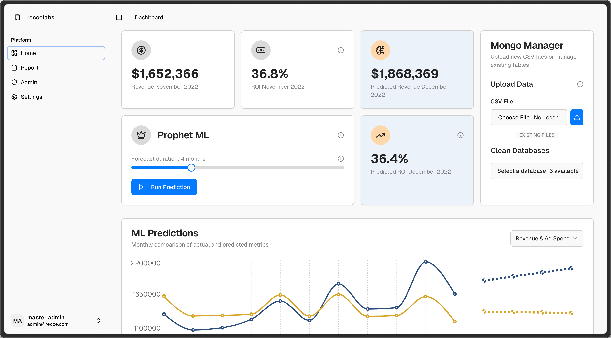
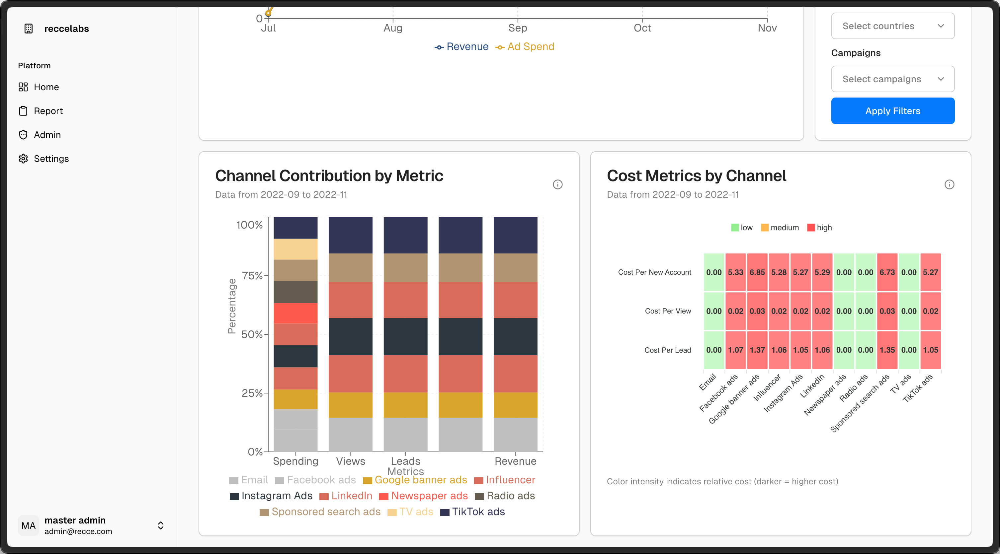
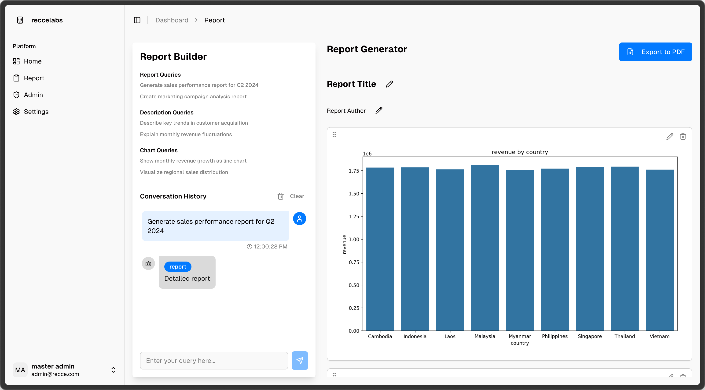
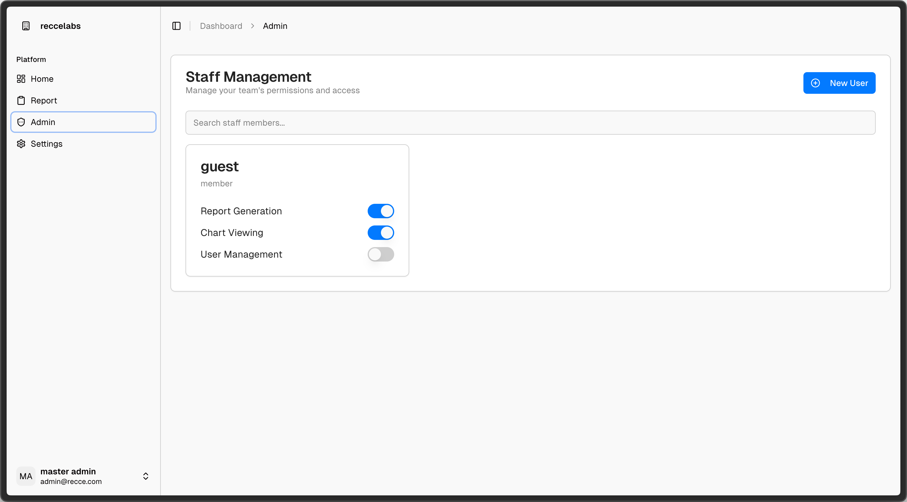
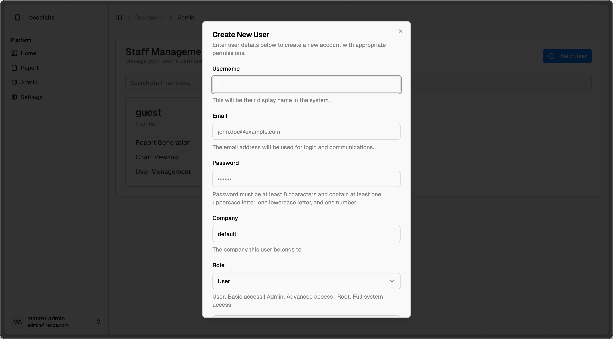

# User Manual

## Step 1: Logging In

To access the dashboard:

1. Navigate to the login page.
2. Enter your **email** and **password**.
3. Click the **Sign In** button to access your personalized analytics dashboard.

## Step 2: Dashboard Overview

Once logged in, you land on the **Dashboard** page.

### Key Metrics Panel

At the top of the dashboard, you can view:

- **Current Revenue**
- **ROI**
- **Predicted Revenue** (using AI)
- **Predicted ROI**

### Mongo Manager (Data Upload)

If no data is available:

1. Go to the **Mongo Manager** section on the right.
2. Click **Choose File** to upload a **CSV file**.
3. Select the database to import data into or clean existing datasets.

### Running Predictions (Prophet ML)

1. Use the **slider** to select your **forecast duration** (e.g., 4 months).
2. Click **Run Prediction** to generate machine learning-based forecasts.

### Visual Insights

#### ML Predictions

- View **actual vs predicted trends** for:
  - Revenue
  - Ad Spend

#### Filter Charts

- Apply filters by **date**, **age group**, **channel**, **country**, or **campaign** to customize your view.

#### Contribution by Channel

- Breakdown of **channel performance** by spending, views, leads, and revenue.

#### Cost Metrics

- Heatmap showing **cost per acquisition** across channels with color-coded intensity (low, medium, high).

## Step 3: Report Generation (Report Tab)

Navigate to the **Report** tab to access the **LLM-powered Report Generator**.

### Report Builder Features:

- Use natural language queries to:
  - Generate sales or marketing campaign reports.
  - Describe customer acquisition trends.
  - Explain fluctuations in revenue.
  - Request visualizations (e.g., charts of regional sales or monthly revenue growth).

### Customize Your Report

- Set a **report title** and **author name**.
- Add a **custom description**.
- Review conversation history of previous queries.
- Export the report directly to **PDF**.

## Step 4: User Management (Admin Tab)

In the **Admin** tab, manage team access and permissions.

### Permissions Include:

- **Report Generation**
- **Chart Viewing**
- **User Management**

To manage a user:

- Use the toggle switches to enable or disable permissions.
- Click **New User** to add a new team member.

## Settings

## Use the **Settings** tab to configure account or platform-level preferences.

## Account Info

Your account info (name and email) is shown in the lower-left sidebar for reference.
