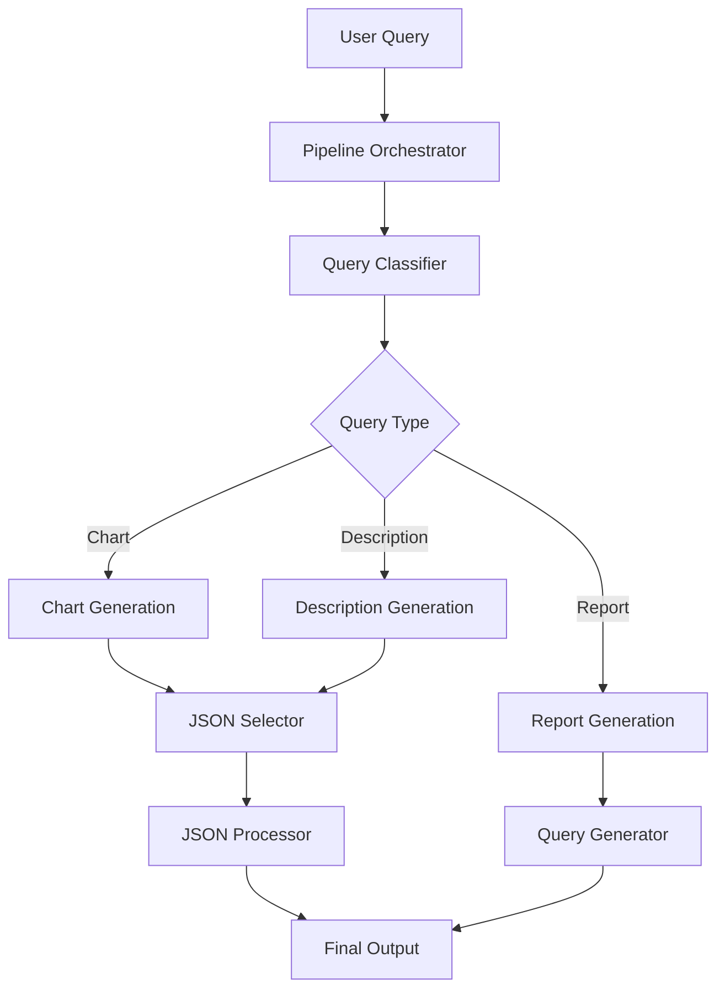
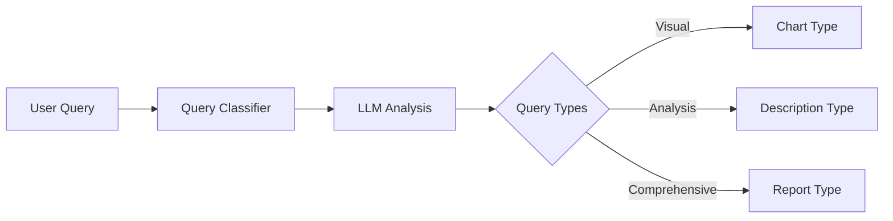
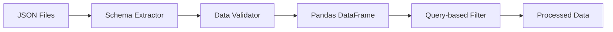
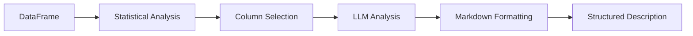
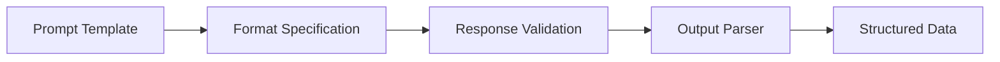
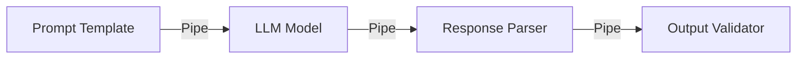
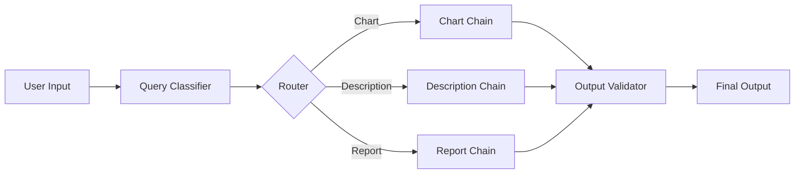

# LLM Architecture and Implementation

## System Overview

The system follows a pipeline architecture for processing user queries through various stages of analysis and generation.



## Key Technologies Used

- LangChain Framework
  - ChatPromptTemplate for structured prompting
  - OllamaLLM for local LLM integration
  - Tool and PythonREPL for code execution
- Pandas for data manipulation
- Seaborn/Matplotlib for visualization
- Pydantic for data validation

## Query Classification Flow



## Key Concepts and Components

### Query Classification System

- Uses LLM to categorize queries into three types:
  - Description: Detailed analysis requests
  - Chart: Visual representation requests
  - Report: Comprehensive analysis requests
- Implements Pydantic models for type validation
- Uses template-based prompting for consistent classification

### JSON Processing System



### Chart Generation System

- Intelligent column selection based on data types
- Supports multiple chart types:
  - Line charts for time series
  - Scatter plots for relationships
  - Bar charts for comparisons
  - Box plots for distributions
  - Heatmaps for correlations

### Description Generation System



## Error Handling and Validation

- Pydantic models for data validation
- Structured error handling throughout pipeline
- Fallback mechanisms for LLM responses
- Data type validation for chart generation

## LLM Implementation Details

### LLM Integration and Model Selection

- Utilizes `langchain_ollama.llms.OllamaLLM` with "llama3.2" model
- Local model deployment for faster inference and data privacy
- Consistent model temperature of 0.7 for balanced creativity and consistency

### Prompt Engineering Patterns

#### Structured Output Prompts



- All prompts designed for structured, parseable outputs
- Example formats:
  ```
  query_type: [description/report/chart]
  x_axis: [column name]
  y_axis: [column name]
  ```
- Context-rich prompts with data schemas and type information

### LangChain Chain Composition



- Uses LangChain's pipe operator (`|`) for chain composition
- Standard pattern: `chain = prompt | model | parse_llm_response`
- Integration with Python REPL for dynamic code execution

### Multi-Stage Processing



- Classification-based routing
- Specialized processing chains for each query type
- Consistent validation across all outputs

### Validation and Error Handling

#### Pydantic Models

- `ChartInfo`: Chart generation parameters
- `QueryType`: Query classification
- `ColumnSelections`: Column selections
- `JSONAnalysisResult`: JSON file selection

#### Response Processing

- Structured parsing of LLM outputs
- Deduplication of responses
- Type checking and conversion
- Fallback mechanisms

### LLM Output Control

#### Format Control

- Strict output formatting requirements
- Example:
  ```
  file: [selected json filename]
  chart_type: [one of: line, scatter, bar, box, heatmap]
  ```

#### Response Validation

- Post-processing of LLM outputs
- Consistency checks
- Type validation
- Error recovery 