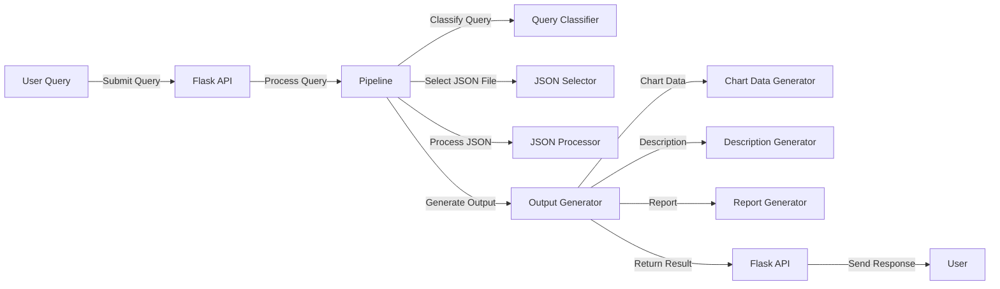
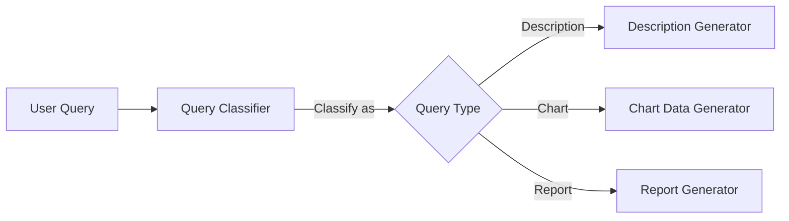

# Project Overview

This project is a sophisticated data analysis pipeline designed to process user queries and generate visualizations, descriptions, and reports based on JSON data files. It leverages machine learning models to classify queries and select appropriate data for analysis, providing a seamless integration of natural language processing and data visualization.

## Tech Stack

- **Python**: The primary programming language used for backend logic, offering extensive libraries for data manipulation and machine learning.
- **Flask**: A lightweight WSGI web application framework used to create the API server, enabling easy deployment and scalability.
- **Pandas**: A powerful data manipulation and analysis library, essential for handling and processing data frames.
- **NumPy**: A library for numerical computations, providing support for large, multi-dimensional arrays and matrices.
- **Pydantic**: Used for data validation and settings management, ensuring data integrity through Python type annotations.
- **Langchain**: A library for building language model applications, facilitating the integration of language models for natural language processing tasks.
- **OllamaLLM**: A language model used for generating responses to natural language queries, enhancing the system's ability to understand and process user input.
- **Recharts**: A charting library used for generating visualizations, though not directly included in the code, it is implied by the chart data structure.

## File Breakdown

### 1. `chart_data_generator.py`

- **Purpose**: This module is responsible for generating chart data based on a user's natural language query and a given DataFrame. It uses a language model to interpret the query and select the appropriate columns for visualization.
- **Key Components**:
  - **`ChartInfo`**: A Pydantic model that defines the structure for chart parameters, including x-axis, y-axis, and chart type.
  - **`get_column_type`**: Determines the data type of a DataFrame column, categorizing it as 'datetime', 'numeric', or 'categorical'.
  - **`select_columns_for_chart`**: Utilizes a language model to select appropriate columns for visualization based on the query. It constructs a prompt with available columns and their data types, then parses the model's response to determine the chart configuration.
  - **`generate_chart_data`**: Prepares data for different types of charts (line, scatter, bar, etc.) and structures it for use with Recharts. It handles data transformation and optimization, ensuring the chart data is concise and relevant.

### 2. `app.py`

- **Purpose**: This file sets up a Flask API server to handle incoming queries and return processed results. It acts as the interface between the user and the data processing pipeline.
- **Key Components**:
  - **`/api/query`**: An endpoint that processes queries through the pipeline. It validates the request, runs the pipeline, and formats the response based on the query type.

### 3. `description_generator.py`

- **Purpose**: This module generates a structured description of data based on a user's query. It performs statistical analysis and uses a language model to create a detailed narrative.
- **Key Components**:
  - **`ColumnSelections`, `HTMLElement`, `StructuredDescription`**: Pydantic models for handling column selections and HTML elements, structuring the output as a series of HTML tags and content.
  - **`analyze_dataframe`**: Performs comprehensive statistical analysis on DataFrame columns, calculating metrics like mean, median, mode, and distribution statistics.
  - **`select_relevant_columns`**: Uses a language model to select relevant columns for analysis, ensuring the description focuses on pertinent data.
  - **`generate_description`**: Creates a structured description using the analyzed data, generating an executive summary with sections like Key Performance Metrics and Trend Analysis.

### 4. `json_processor.py`

- **Purpose**: This module processes JSON files based on user queries, potentially filtering the data to match the query's intent.
- **Key Components**:
  - **`validate_filter_values`**: Validates and adjusts filter code based on actual column values, ensuring the filtering logic is accurate and applicable.
  - **`process_json_query`**: Loads a JSON file into a DataFrame and applies any necessary filtering based on the query. It uses a language model to determine if filtering is needed and executes the filtering logic.

### 5. `pipeline.py`

- **Purpose**: This is the core module that orchestrates the entire data processing pipeline. It integrates all components to process queries and generate outputs.
- **Key Components**:
  - **`PipelineResult`**: A data class to store the results of the pipeline, including the selected JSON file, original query, processed DataFrame, query type, and output.
  - **`run_pipeline`**: Executes the pipeline steps: query classification, JSON selection, JSON processing, and output generation. It coordinates the flow of data and logic across modules.
  - **`display_results`**: Formats and displays the results of the pipeline, providing a user-friendly output of the processed data.

### 6. `json_selector.py`

- **Purpose**: This module selects the most appropriate JSON file for a given query using a language model. It analyzes the available JSON files and their contents to make an informed selection.
- **Key Components**:
  - **`JSONAnalysisResult`**: A Pydantic model for storing the selected JSON file and query details, including the reason for selection and matching fields.
  - **`extract_json_info`**: Extracts field and sample value information from JSON files, building a comprehensive map of available data.
  - **`select_json_for_query`**: Uses a language model to determine the most relevant JSON file for the query, considering field matches and value relevance.

### 7. `query_classifier.py`

- **Purpose**: This module classifies user queries into types: description, report, or chart. It uses a language model to interpret the query and apply classification rules.
- **Key Components**:
  - **`QueryType`**: A Pydantic model for storing query classification results, including the original query and its type.
  - **`QueryClassifier`**: Uses a language model to classify queries based on predefined rules, ensuring accurate categorization for further processing.

### 8. `report_generator.py`

- **Purpose**: This module generates analysis queries based on user input and JSON schemas. It creates sub-queries for comprehensive analysis, focusing on various data insights.
- **Key Components**:
  - **`QueryList`**: A Pydantic model for storing generated analysis queries, each consisting of a query type and text.
  - **`generate_analysis_queries`**: Uses a language model to create sub-queries for comprehensive analysis, ensuring a diverse set of insights are generated.

## Features

- **Natural Language Processing**: Utilizes language models to interpret and process user queries, enabling intuitive interaction with the system.
- **Data Visualization**: Generates chart data for visual representation using Recharts, providing clear and informative visual insights.
- **Statistical Analysis**: Provides detailed statistical insights into data, offering a comprehensive understanding of data characteristics.
- **Flexible Query Handling**: Supports various query types, including descriptions, reports, and charts, ensuring versatile data analysis capabilities.
- **JSON Data Processing**: Efficiently handles and processes JSON data files for analysis, ensuring data integrity and relevance.
